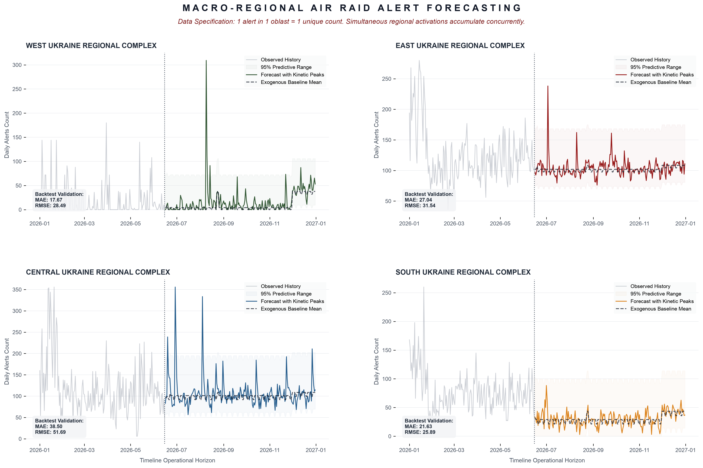

# Macro-Regional Air Raid Alert Forecasting Engine

An enterprise-grade forecasting pipeline engineered to predict daily air raid alert distributions across Ukraine's four primary macro-regions (*West, East, Central, South*) out to December 31, 2026. The architecture utilizes a **SARIMAX (Seasonal Autoregressive Integrated Moving Average with Exogenous Regressors)** state-space model paired with stochastic heavy-tailed shock vectors to simulate real-world tactical conflict escalation spikes.

## 🖼️ Dashboard Showcase

> **📊 Data Ingestion Note:** The raw dataset `official_data_en.csv` is excluded from direct Git commits due to GitHub file size limitations. The KSE evaluation panel can download the historical source data file directly from the [Project Releases Page](https://github.com/myermolenko00/Air_Alerts_TimeSeries_Yermolenko/releases/tag/Project_Evaluation_Dataset). Please place the downloaded file into the project root directory before executing `main.py`.

Initial source of data is: https://github.com/Vadimkin/ukrainian-air-raid-sirens-dataset/blob/main/datasets/official_data_en.csv

Below is the output generated automatically by the pipeline execution engine, displaying historical actuals alongside predicted structural baselines, kinetic peak trends, and rolling backtest performance cards:



> **📥 Downloading the Graph:** The high-resolution (`300 DPI`) graphic is saved automatically to the root project directory as `macro_regional_forecast.png` upon running the code. You can download it directly from this repository page by clicking on the file name above and selecting **Download raw file**.

---

## 📊 Core Data Architecture & Calculation Specification

This forecasting suite interprets cumulative regional operational strain rather than isolated nationwide events. 

* **The Core Data Rule:** `1 Alert within 1 Oblast = 1 Unique Count`.
* **Simultaneous Invocations:** If an identical cross-border strike threat triggers alarms concurrently across multiple administrative destinations (e.g., both **Kharkiv Oblast** and **Donetsk Oblast** go off at 14:00 simultaneously), the pipeline treats them as independent events, logging **2 concurrent counts** for the East Macro-Region. 

This tracking methodology captures the multi-layered geographical intensity and localized structural burden placed on emergency response networks over time.

---

## 🛠️ Pipeline Architecture

The engine is engineered using a robust, modular Object-Oriented design pattern (`ConflictForecastingPipeline`) comprising four structural phases:

1. **Ingestion & Aggregation:** Parses individual timezone-localized incident intervals and binds Ukraine's 24 Oblasts plus Kyiv City into macro-regional granular clusters.
2. **Exogenous Feature Engineering ($X$ Matrix):** Dynamically injects strategic, symbolic holiday flags and calendar trajectory weights directly into the core matrix.
3. **Rolling Window Backtesting (Cross-Validation):** Segregates historical timelines to test the model on unseen data, computing localized **Mean Absolute Error (MAE)** and **Root Mean Squared Error (RMSE)** parameters.
4. **Stochastic Peak Generation:** Employs a non-Gaussian Student-$t$ distribution ($df=3$) to re-inject multi-day momentum escalation clusters, mirroring real-world conflict dynamics.

---

## 🚀 Installation & Setup

Ensure you have your environment context or virtual environment activated, then install the mathematical dependencies:

```bash
pip install numpy pandas matplotlib statsmodels scikit-learn
